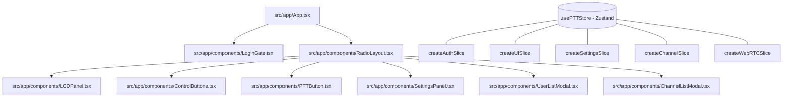
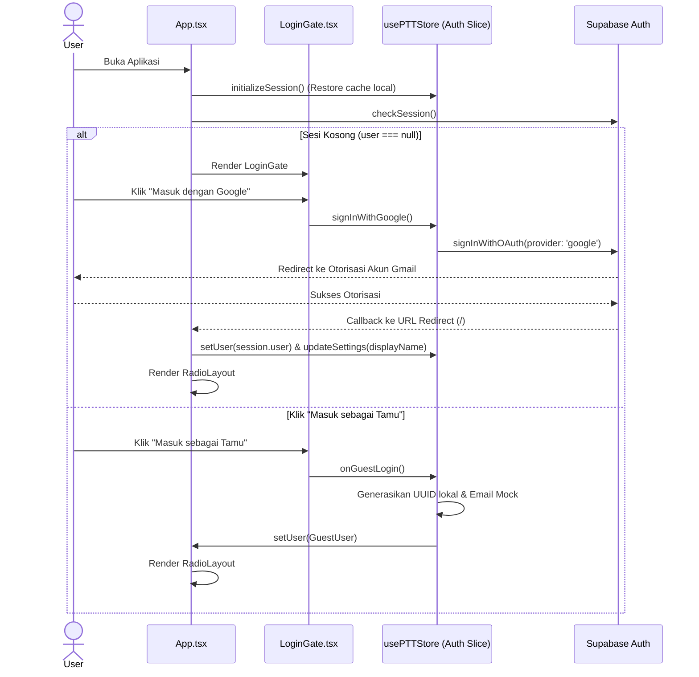
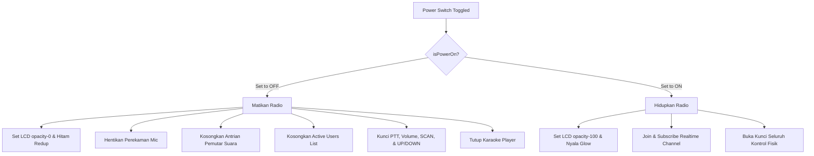
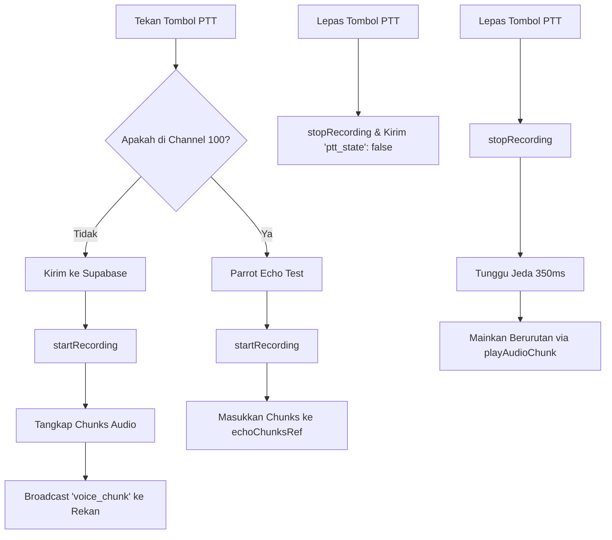

# Cara Kerja Logika Fitur - NextVWT PTT App

Dokumen ini disusun untuk memberikan pemahaman teknis yang mendalam dan komprehensif mengenai arsitektur, alur logika, state management, serta integrasi layanan pada aplikasi **NextVWT (Next Virtual Walkie Talkie)**. Dokumen ini berfungsi sebagai panduan bersama agar seluruh tim pengembang memiliki pemahaman konteks yang selaras.

---

## 🗺️ I. Peta Arsitektur File & Struktur Data

Aplikasi dibangun di atas React + TypeScript dengan bundling Vite, dan dibungkus menggunakan Capacitor untuk distribusi native Android. State management dikelola secara terpusat menggunakan **Zustand** dengan arsitektur slice-based.



### 🗄️ Zustand Store: `usePTTStore`
State global didefinisikan dalam `src/app/store/types.ts` dan digabungkan di `src/app/store/usePTTStore.ts` melalui 5 slice utama:

1. **`createAuthSlice.ts`**:
   - `user`: Menyimpan data sesi pengguna saat ini (Supabase Auth `User` atau `GuestUser` object).
   - `activeTransmitter`: Objek metadata pengguna yang sedang menekan PTT / berbicara di channel (`{ userId, displayName, callSign, isNewUser }`).
   - `activeUsers`: Array pengguna yang saat ini terdeteksi online di channel yang sama berdasarkan data Presence.
   - `signInWithGoogle()`: Fungsi masuk via Google OAuth.
   - `signOut()`: Fungsi logout.
2. **`createUISlice.ts`**:
   - `isPowerOn`: Status daya perangkat (ON/OFF).
   - `isSettingsOpen`, `isUserListOpen`, `isChannelModalOpen`: Status visibilitas modal panel.
   - `hasCompletedOnboarding`: Status penyelesaian panduan pertama kali.
   - `showFeedbackModal`: Status visibilitas modal pengumpul rating audio.
3. **`createSettingsSlice.ts`**:
   - `infoText`: Nama tampilan pengguna (Username).
   - `locationText`: Lokasi fisik pengguna (Format: `Kota, Provinsi`).
   - `profilePhotoOption`: Pilihan sumber foto (`'google'` atau `'custom'`).
   - `customPhotoUrl`: Data URL Base64 dari foto galeri yang diunggah.
   - `themeText`: Nama kelas tema aktif (misal: `theme-classic`, `theme-v6`).
   - `audioMode`: Mode pemrosesan audio (`'discussion'` atau `'music'`).
   - `builtInEcho`: Status efek gema software lokal.
   - `echoFeedback`: Intensitas gema (0 - 100).
   - `maxQueue`: Jumlah maksimal antrian buffer audio (default: `'99999'`).
   - `pttSize` & `pttBottom`: Posisi dan skala visual tombol PTT.
4. **`createChannelSlice.ts`**:
   - `channelNumber` / `channelId`: Saluran numerik aktif (1 - 999) dan UUID representasinya.
5. **`createWebRTCSlice.ts`**:
   - Logika komunikasi audio Peer-to-Peer peer-mesh untuk latensi ultra-rendah (opsional fallback dari Supabase realtime).

---

## 🔑 II. Logika Autentikasi (Login Access)

Ketika aplikasi dijalankan, `<App />` memicu listener autentikasi Supabase untuk memeriksa sesi. Jika sesi tidak ditemukan (`user === null`), `<LoginGate />` ditampilkan.



### 1. Masuk dengan Google
- Tombol memicu `supabase.auth.signInWithOAuth` dengan parameter `provider: 'google'`.
- Pengguna diarahkan ke halaman Gmail eksternal untuk verifikasi akun Google mereka.
- Setelah otorisasi diberikan, browser dialihkan kembali ke URL root.
- Aplikasi membaca sesi yang baru dibuat secara asinkronus, mengimpor `full_name` dari metadata Google ke dalam `infoText` store, dan mengubah avatar ke opsi `'google'`.

### 2. Masuk sebagai Tamu (Guest Mode)
- Berguna untuk akses cepat tanpa login sosial.
- Menghasilkan ID unik `guest-<UUID>` menggunakan browser `crypto.randomUUID()` dengan fallback pencocokan ekspresi reguler.
- Email disimulasikan sebagai `guest-<UUID>@guest.nextvwt.local` agar memenuhi validasi skema database di database Supabase.
- Username diset otomatis menjadi `"Tamu XXXX"` (diambil dari 4 digit terakhir UUID).

---

## 🔌 III. Logika Tombol Power (Power Switch)

Sakelar ON/OFF radio menggunakan komponen khusus `<ToggleSwitch />` yang memicu pembaruan state `isPowerOn` di store.



### 1. Transisi ke OFF (Mati)
- **LCD Display**: Komponen `<LCDPanel />` menyembunyikan kontainer utama (`opacity-0`) dengan transisi `duration-300` agar memberikan efek layar tabung meredup perlahan.
- **Audio Cleanup**: Menghentikan proses perekaman microphone (`stopRecording()`) jika pengguna sedang mentransmisikan audio. Antrian buffering audio dibersihkan secara instan melalui `flushAudioQueue()` untuk mencegah gema suara yang tertunda diputar ketika perangkat mati.
- **Presence Unsubscription**: Kehadiran pengguna di channel dinonaktifkan di backend sehingga nama mereka hilang dari daftar pengguna aktif di perangkat rekan lain.
- **Interactions Blocked**:
  - Tombol **PTT** absolut membungkus kelas CSS `pointer-events-none` dengan opasitas redup.
  - Tombol **SCAN**, **UP (▲)**, dan **DOWN (▼)** dikunci. Status daya dievaluasi dalam fungsi penanganan klik tombol-tombol tersebut.

### 2. Transisi ke ON (Hidup)
- **LCD Display**: Mengembalikan visibilitas (`opacity-100`) dan memicu inisialisasi visual tema casing yang dipilih.
- **Real-time Channel Subscription**: Memanggil `subscribeToChannel()` di store, menyambungkan kembali koneksi Supabase Realtime, dan melacak presence pengguna secara otomatis.

---

## 📶 IV. Logika Layar LCD & Status Koneksi

Sasis layar LCD memuat elemen penting: Kekuatan Sinyal, Indikator Latensi, Indikator Status, Nama Aktif, dan Saluran Terpilih.

### 1. Kekuatan Sinyal (Signal Bars)
- Jika perangkat **Online**, state `signalBars` berfluktuasi antara 1 s.d 4 bar setiap 5 detik dengan rasio bobot probabilitas:
  - 4 Bar (Probabilitas 75%): Sinyal sangat baik. Latar bar diisi gradien hijau neon.
  - 3 Bar (Probabilitas 15%): Sinyal baik. Latar bar hijau.
  - 2 Bar (Probabilitas 7%): Sinyal sedang. Latar bar kuning.
  - 1 Bar (Probabilitas 3%): Sinyal buruk. Latar bar merah.
- Jika perangkat **Offline**, state `signalBars` dipaksa bernilai `0` (semua bar diisi warna abu-abu putih kosong).

### 2. Indikator Sinyal Silang Merah (`×`)
- Ditampilkan secara absolut di pojok kiri atas bar sinyal jika dan hanya jika `isOffline === true`.
- Menandakan kegagalan koneksi WebSocket Supabase atau saat internet terputus secara fisik di browser.

### 3. Latency Tooltip
- Klik pada bar sinyal memicu tooltip terapung yang menghitung estimasi latensi dalam milidetik (`ms`):
  - Jika 4 bar: Latensi antara `25ms - 40ms` (Acak).
  - Jika 3 bar: Latensi antara `45ms - 70ms`.
  - Jika 2 bar: Latensi antara `75ms - 120ms`.
  - Jika 1 bar: Latensi antara `125ms - 225ms`.
  - Jika Offline: Menampilkan tulisan `Latency: Offline`.
- Tooltip ditutup secara otomatis setelah 3 detik menggunakan `setTimeout`.

### 4. Status Badges (OFFLINE & BUSY)
- **Badge Offline**: Muncul jika status `isOffline === true`. Menyematkan ikon antena pemancar dengan tanda seru.
- **Badge Busy**: Muncul jika ada pengguna lain yang terdeteksi sedang memancar di channel (`isReceiving === true`), memperingatkan pengguna lain agar tidak menabrak transmisi (radio etiquette).

---

## 🎤 V. Mekanisme PTT (Push-To-Talk) & Parrot Echo (CH 100)

Sistem pengiriman audio menggunakan Web Audio API untuk menangkap suara dari microphone dan mengompresinya menjadi potongan Base64 (chunks) per 20 milidetik.



### 1. Transmisi Standar (Channel selain 100)
- Menekan tombol PTT memicu `startRecording()` yang membuka akses microphone.
- Setiap chunk 20ms dikirim melalui WebSocket Supabase ke channel realtime:
  ```typescript
  channelInstance.send({
    type: 'broadcast',
    event: 'voice_chunk',
    payload: { userId, base64: base64Chunk }
  });
  ```
- Rekan satu channel mendengarkan event `'voice_chunk'` dan meneruskannya ke `playAudioChunk(base64)` untuk diputar di speaker mereka secara berurutan.

### 2. Tes Modulasi Lokal (Khusus Saluran 100)
Channel 100 bertindak sebagai simulator loopback lokal.
- Ketika mic merekam, callback `startRecording` mendeteksi channel aktif `=== 100`.
- Chunks audio tidak dikirim ke Supabase, melainkan ditambahkan ke array references lokal:
  ```typescript
  echoChunksRef.current.push(base64Chunk);
  ```
- Begitu tombol PTT dilepas (lepas tekan), perekaman mic ditutup, jeda asinkronus `350ms` dipicu, dan array buffer `echoChunksRef.current` dimainkan kembali secara berurutan ke speaker internal pengguna. Ini memungkinkan pengguna mendengarkan modulasi suaranya sendiri secara offline.

### 3. Animasi Cahaya & Indikator Megaphone (Ikon Speaker)
Untuk menjaga keakuratan status transmisi, indikator berbicara (**Megaphone/Speaker Icon**) dan animasi pijar (**Active Glow Animation**) dikendalikan 100% oleh status modulasi nyata (bukan simulasi):
- **Logika Pemancar Aktif**:
  - **Pengguna Lokal**: Saat menekan PTT (`isTransmitting === true`), baris akun lokal di `<UserListModal />` akan berkedip dengan efek pijar biru (`.active-user-glow`) dan memunculkan ikon megaphone pemancar aktif.
  - **Pengguna Rekan (Remote)**: Saat data websocket broadcast mendeteksi adanya transmitter aktif (`activeTransmitter !== null` dan cocok dengan `profile.userId`), baris rekan tersebut akan otomatis menyalakan efek pijar `.active-user-glow` dan memunculkan ikon megaphone.
- **Pembersihan Simulator Acak**: Simulator interval acak (`activeSpeakerIdx` simulator yang sebelumnya secara acak menyalakan status berbicara pengguna palsu setiap 5 detik) telah **dihapus sepenuhnya** dari `<UserListModal />`. Dengan ini, indikator suara dan cahaya hanya akan menyala jika ada modulasi PTT nyata di channel.

---

## ⚙️ VI. Panel Pengaturan (Settings Panel - SET)

Pengguna dapat menekan tombol **SET** di bagian bawah untuk memodifikasi preferensi visual dan fungsionalitas walkie-talkie.

### 1. Editor Foto Profil & Sumber segmented
Pengguna disajikan Segmented Control dengan 2 pilihan:
- **Foto Google**: Hanya diaktifkan jika pengguna masuk dengan Google OAuth. Mengambil url avatar yang terintegrasi dengan akun Google (`user.user_metadata.avatar_url`).
- **Unggah Galeri (Custom)**: 
  - Mengaktifkan input file tersembunyi `<input type="file" accept="image/*" />` secara programatik.
  - Membaca file gambar terpilih menggunakan `FileReader` dan me-load-nya ke dalam HTML5 `Image`.
  - Menggambar ulang gambar ke dalam `<canvas>` ukuran tetap **120px (Lebar) × 140px (Tinggi)** untuk memastikan kecocokan rasio kotak casing profile.
  - Mengompres hasilnya menjadi string Base64 dengan format JPEG dan kualitas kompresi `0.75` untuk meminimalisasi memori local storage dan traffic presence.

### 2. Mode Audio & Konfigurasi Echo Software
- **Mode Musik & Karaoke**: Menaikkan sample-rate dan bit-rate pemrosesan suara, serta membuka slider **Efek Echo Built-in (Software)**.
- **Built-in Echo**: Menggunakan Web Audio API `DelayNode` dan `GainNode` di sisi hook audio untuk membuat loopback feedback gema lokal sebelum audio diputar ke speaker. Slider **Intensitas Gema** mengatur nilai gain node gema (0 - 100%).

### 3. Tema Casing Dinamis
- Pergantian tema casing radio memicu modifikasi variabel CSS kustom di elemen induk HTML (`src/styles/theme.css`):
  - `--device-bg`: Warna casing luar sasis (termasuk efek terumbu karang Live Aquarium di tema v6).
  - `--lcd-bg`: Warna latar LCD (oranye, cyan, hijau neon, dll).
  - `--lcd-text-color` & `--lcd-label-color`: Warna nomor frekuensi segmen DSEG7 dan label teks.

---

## 💾 VII. Ketahanan Data (Robustness & Persistence)

Aplikasi dirancang agar tahan banting terhadap kegagalan jaringan dan reload tidak disengaja.

### 1. Mekanisme Delta-Sync LocalStorage
Setiap kali ada pembaruan pengaturan melalui `updateSettings(settings)`, aplikasi memicu fungsi filter:
```typescript
safeSetStorage(pickPersistedState(settings));
```
Hanya kunci yang terdaftar di `PERSISTED_KEYS` (seperti `infoText`, `themeText`, `hasCompletedOnboarding`, `lastFeedbackTime`) yang ditulis ke `localStorage`. State runtime memori (seperti daftar user aktif, transmitter aktif, status koneksi) dikecualikan untuk menghindari pembengkakan penyimpanan.

### 2. Pemulihan Sesi (Offline Recovery)
Pada siklus hidup awal aplikasi di `initializeSession()`:
1. State cache dibaca dari `localStorage`.
2. Jika data cache valid, state store diisi ulang menggunakan konfigurasi terakhir yang disimpan.
3. Call Sign acak 5-karakter baru digenerasikan dan disimpan hanya jika pengguna belum memilikinya di cache.
4. Aplikasi secara optimis menyambungkan kembali ke saluran frekuensi terakhir yang digunakan pengguna sebelum aplikasi ditutup/di-refresh.
