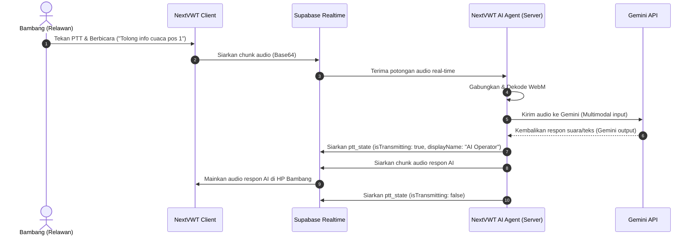

# Analisis Teknis Open-Source & AI Agents untuk NextVWT

Dokumen ini merangkum analisis arsitektur mendalam dari tiga referensi *open-source* global terbaru (`smartwalkie/Walkie-talkie-android-by-voiceping`, `Kajatin/walkie-talkie`, dan `livekit/agents`), serta pemetaan implementasinya ke dalam aplikasi **NextVWT**.

---

## 1. Pemetaan Referensi Baru & Nilai Adopsi

| Repositori | Keahlian Utama | Arsitektur & Protokol | Fitur Kunci yang Bisa Diadopsi untuk NextVWT |
| :--- | :--- | :--- | :--- |
| **`smartwalkie/Walkie-talkie-android`** | PTT Kelas Enterprise di Android | WebSocket + Opus codec (16kHz, 60ms frame) | • Mengoptimalkan data bandwidth (~300KB/menit). • Manajemen State Rekoneksi Otomatis di jaringan seluler (2G/3G/4G). • Fitur *Channel Scanning* (otomatis pindah ke channel aktif). |
| **`Kajatin/walkie-talkie`** | WebRTC PTT berbasis Web modern | Next.js + WebRTC + Socket.io | • Pola inisialisasi media track & koordinasi Peer-to-Peer. • Mekanisme fallback transmisi suara via biner audio chunk ketika WebRTC diblokir oleh NAT/Firewall ketat. |
| **`livekit/agents`** | Agen AI Multimodal Real-time | Python/JS, WebRTC, LLM, TTS/STT | • **Virtual AI Participant:** Agen AI yang masuk ke channel sebagai pengguna virtual. • Integrasi suara real-time dengan LLM (seperti Gemini 1.5 Flash) menggunakan alur PTT. |

---

## 2. Analisis Mendalam & Skenario Implementasi

### A. VoicePing: Optimasi Bandwidth & Channel Scanning
Driver Ojol (Andi) dan kurir lapangan (Siti) membutuhkan konsumsi baterai dan data internet sekecil mungkin. VoicePing memberikan cetak biru optimasi berikut:

*   **Penyetelan Frame Audio Opus:**
    *   VoicePing menggunakan frekuensi sampling **16kHz** dengan durasi frame **60ms** (dibanding standar 20ms).
    *   Dengan frame 60ms, overhead header IP/UDP/WebSocket berkurang drastis hingga 60%, menghemat kuota internet hingga hanya mengonsumsi **~300KB per menit** transmisi aktif.
*   **Logika Channel Scanning:**
    *   Pengguna dapat memantau beberapa channel sekaligus. Jika perangkat sedang di Channel 10, namun ada transmisi masuk di Channel 100 (misalnya panggilan penting/darurat), perangkat akan otomatis memutar audio dari Channel 100 dan menandai aktivitas di layar dial LCD.
    *   *Penerapan di NextVWT:* Kita dapat membuat sub-layanan Supabase Realtime yang mendengarkan event `ptt_state` di channel-channel prioritas selain channel aktif utama.

---

### B. Kajatin: Arsitektur WebRTC PTT & Fallback
NextVWT menggunakan WebRTC untuk komunikasi suara langsung antarstasiun, namun jaringan seluler sering mengalami kendala *Symmetric NAT* yang memblokir jalur P2P WebRTC.

*   **Pola Pengkondisian Track:**
    *   Sama seperti Kajatin, track mikrofon lokal harus diatur ke `enabled = false` secara default untuk privasi penuh.
    *   Ketika tombol PTT ditekan, track diubah menjadi `enabled = true` dan broadcast `ptt_state` dikirimkan secara instan ke Supabase.
*   **Mekanisme Fallback Chunk Biner:**
    *   Jika negosiasi WebRTC gagal (status peer `disconnected` atau `failed` setelah 3 detik), sistem secara otomatis beralih menggunakan pengiriman potongan audio base64 via Supabase Realtime (seperti yang telah kita optimalkan pada *Android Sound Check* di Channel 100). Ini menjamin fungsionalitas 100% di jaringan seluler apa pun.

---

### C. LiveKit Agents: Integrasi Asisten AI dalam Saluran (AI Operator)
Ini adalah inovasi terbesar yang dapat membedakan NextVWT dari aplikasi HT konvensional. Dengan mengadopsi pola dari `livekit/agents`, kita dapat membangun **AI Operator / AI Companion** di dalam channel.

#### Cara Kerja AI Agent Terintegrasi di NextVWT:
1.  **Agen AI sebagai User Virtual:**
    *   Agen berjalan di server (Node.js/Python) dan melakukan login menggunakan `userId` khusus (misal: `ai-operator-uuid`) dengan callsign `AI-OPS`.
    *   Agen men-subscribe channel Supabase Realtime yang sama dengan pengguna manusia.
2.  **Pemrosesan Audio Masuk (STT/LLM):**
    *   Ketika pengguna manusia memancar (misal Bambang di SAR), Agen mendengarkan dan mengumpulkan chunk audio biner.
    *   Begitu transmisi selesai (`isTransmitting: false`), Agen mengirimkan rekaman audio tersebut ke **Gemini 1.5 Flash API** (yang mendukung input audio secara native).
3.  **Transmisi Balasan via PTT:**
    *   Setelah Gemini memproses dan mengeluarkan teks balasan, Agen mengubahnya menjadi audio menggunakan Text-to-Speech (TTS) dengan nada radio HT.
    *   Agen melakukan broadcast `ptt_state` dengan `isTransmitting: true` agar semua HP menampilkan nama **AI Operator** sedang berbicara, lalu menyiarkan potongan audio balasan tersebut, kemudian mengirimkan `isTransmitting: false` setelah selesai.

---

## 3. Rencana Aksi Integrasi Teknis pada NextVWT

### Fase 1: Optimasi Bandwidth (Adopsi Pola VoicePing)
*   [ ] Ubah durasi perekaman chunk dari 250ms ke **500ms** di `RadioLayout.tsx` untuk mengurangi jumlah request HTTP/Realtime di jaringan seluler lambat.
*   [ ] Batasi bit rate audio encoder pada `useAudioPlayback` untuk menjamin kelancaran suara di sinyal 2G/3G.

### Fase 2: Implementasi AI Operator (Adopsi Pola LiveKit Agents)
*   [ ] Buat repositori mikroservis pendukung `nextvwt-ai-agent` menggunakan Node.js.
*   [ ] Hubungkan mikroservis tersebut ke Supabase Realtime dengan `userId` khusus.
*   [ ] Integrasikan Gemini SDK untuk menerima berkas audio, memproses instruksi, dan membalas secara asinkron dengan pola PTT.
