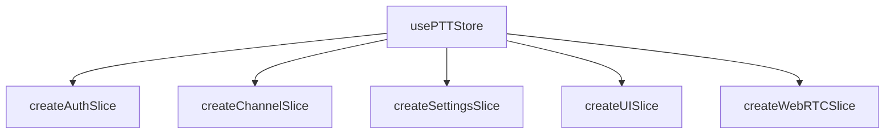

# Dokumentasi Sistem dan Fungsi (Logic/Backend) NextVWT

Dokumen ini menyajikan ekstraksi arsitektur sistem, alur fungsi, logika bisnis, dan state machine dari NextVWT-PTT-App-Prototype tanpa mengubah desain antarmuka pengguna (UI/Frontend).

---

## 1. Arsitektur State Management (Zustand Store)

State aplikasi dikelola menggunakan **Zustand** dengan arsitektur slice-based pada [usePTTStore.ts](file:///C:/Users/ASUS/.gemini/antigravity-ide/scratch/NextVWT-PTT-App-Prototype/src/app/store/usePTTStore.ts) yang mengimpor slice independen:



### 1.1 Pembagian Slice & Tanggung Jawab
*   **`createAuthSlice`**: Mengatur autentikasi pengguna dengan Supabase Auth, sinkronisasi profil (nama, avatar, status premium), dan koin dompet digital (*wallet coin*).
*   **`createChannelSlice`**: Mengelola daftar channel, channel aktif saat ini, status kunci/privasi channel, sandi channel, dan log aktivitas moderator.
*   **`createSettingsSlice`**: Menyimpan konfigurasi pengguna lokal (volume PTT, sensitivitas mic/VAD, keaktifan roger beep, vibrasi, tema visual, dan status background survival).
*   **`createUISlice`**: Mengatur state antarmuka yang volatil seperti status transmisi (`isTransmitting`), penerima aktif (`activeTransmitter`), progress level modulasi (`progress`), serta manajemen daftar antrean karaoke.
*   **`createWebRTCSlice`**: Mengelola koneksi peer-to-peer WebRTC, ICE candidates, status sambungan WebRTC, dan stream audio lokal/remote.

---

## 2. Sistem & Mesin Audio (Audio Engine & VAD)

NextVWT mengimplementasikan pemrosesan audio tingkat rendah berbasis Web Audio API untuk mewujudkan fungsionalitas Walkie-Talkie analog yang otentik.

### 2.1 Alur Transmisi Audio (PTT Outbound)
Ketika tombol PTT ditekan:
1.  **Haptic Feedback**: Memicu getaran pendek 15ms menggunakan `navigator.vibrate`.
2.  **Sound Synthesis (Pre-Press Tone)**: Menghasilkan tone sinus bersih 1000Hz (80ms) yang dicampur dengan *pink noise* tersaring untuk menyimulasikan gerbang squelch terbuka.
3.  **Microphone Acquisition**: Mengambil mikrofon melalui `navigator.mediaDevices.getUserMedia`.
4.  **VAD Activation**: Mengaktifkan [useVAD.ts](file:///C:/Users/ASUS/.gemini/antigravity-ide/scratch/NextVWT-PTT-App-Prototype/src/app/hooks/useVAD.ts) to measure level RMS secara real-time. Jika suara di bawah ambang batas selama waktu tertentu (`silenceTimeout`), track mic di-mute secara lokal untuk menghemat bandwidth.
5.  **Audio Encoding & Streaming**: Stream audio dikirimkan ke peer WebRTC yang terhubung.

### 2.2 Roger Beep & Squelch Tail (PTT Outbound End)
Ketika tombol PTT dilepas:
1.  **Squelch Tail Open**: Menghasilkan derau analog (*pink noise* terfilter bandpass 700Hz - 3200Hz) selama 200ms.
2.  **Roger Beep**: Memainkan urutan 3 nada frekuensi tinggi berturut-turut (1450Hz, 1150Hz, 1320Hz) yang diperhalus dengan *WaveShaperNode* untuk menghasilkan distorsi harmonik analog yang khas.
3.  **Squelch Tail Close**: Memainkan derau penutup singkat (60ms) disusul letupan listrik frekuensi rendah (60Hz turun ke 20Hz) menyimulasikan saklar fisik walkie-talkie terputus.

### 2.3 Audio Synthesis untuk Fitur Reaksi (Local Sound Playback)
Melalui [useReactionSounds.ts](file:///C:/Users/ASUS/.gemini/antigravity-ide/scratch/NextVWT-PTT-App-Prototype/src/app/hooks/useReactionSounds.ts), suara efek reaksi disintesis langsung menggunakan Web Audio API tanpa menggunakan aset file `.mp3`:
*   `laugh`: Modulasi frekuensi meluncur naik-turun cepat.
*   `buzzer`: Gelombang gergaji (*sawtooth*) frekuensi rendah 120Hz yang terdistorsi.
*   `drum`: Letupan sinus frekuensi sangat rendah dengan *exponential decay* cepat.
*   `horn`: Dua osilator gigi gergaji yang saling berdampingan untuk efek klakson terompet.

---

## 3. Protokol Pensinyalan & Supabase Realtime

Saluran komunikasi antar pengguna diatur melalui Supabase Realtime Broadcast.

### 3.1 Skema Event Payload
*   **`ptt_state`**:
    Menginformasikan perubahan status transmisi pembicara.
    ```json
    {
      "userId": "uuid-pembicara",
      "username": "Nama Pembicara",
      "isTransmitting": true,
      "channelNumber": 1
    }
    ```
*   **`reaction`**:
    Menyiarkan reaksi sosial (animasi/suara/gift) ke semua pengguna dalam channel yang sama.
    ```json
    {
      "senderId": "uuid-pengirim",
      "senderName": "Nama Pengirim",
      "category": "sound | animation | gift",
      "reactionId": "laugh | buzzer | rose | diamond"
    }
    ```
*   **`kick`**:
    Event moderasi untuk memutus paksa sambungan pengguna yang melanggar aturan dan melemparnya ke Channel Darurat (CH 302).

---

## 4. Alur Integrasi WebRTC (Peer Connection)

Logika koneksi WebRTC dikelola secara terpusat oleh [useWebRTC.ts](file:///C:/Users/ASUS/.gemini/antigravity-ide/scratch/NextVWT-PTT-App-Prototype/src/app/hooks/useWebRTC.ts):

1.  **ICE Server Configuration**: Menghubungkan client ke STUN/TURN server Biznet Gio (fallback lokal jika dinonaktifkan di CI).
2.  **Signaling Negotiation**: Pertukaran Offer-Answer SDP didelegasikan secara asinkron menggunakan saluran Supabase Realtime.
3.  **Dynamic Track Management**: Audio track dari mic lokal disuntikkan secara dinamis saat status transmisi aktif, dan track penerima remote diontologi oleh `AudioContext` untuk memantau modulasi suara mereka secara langsung.
4.  **Local Audio Modulation Output**: Mengirimkan level RMS audio remote ke progress bar (indikator laser) ketika ada orang lain yang mentransmisikan suara.
